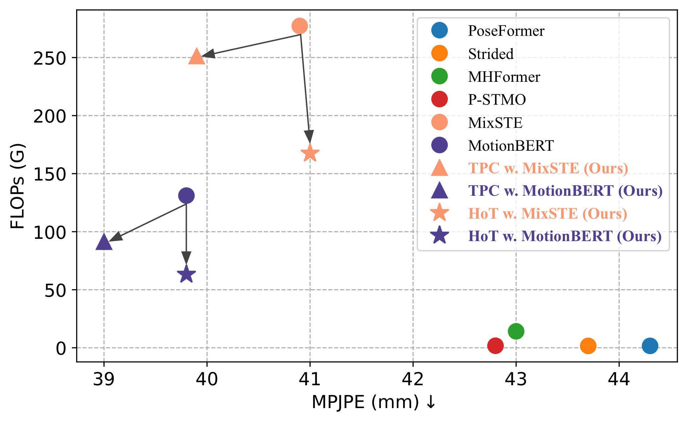
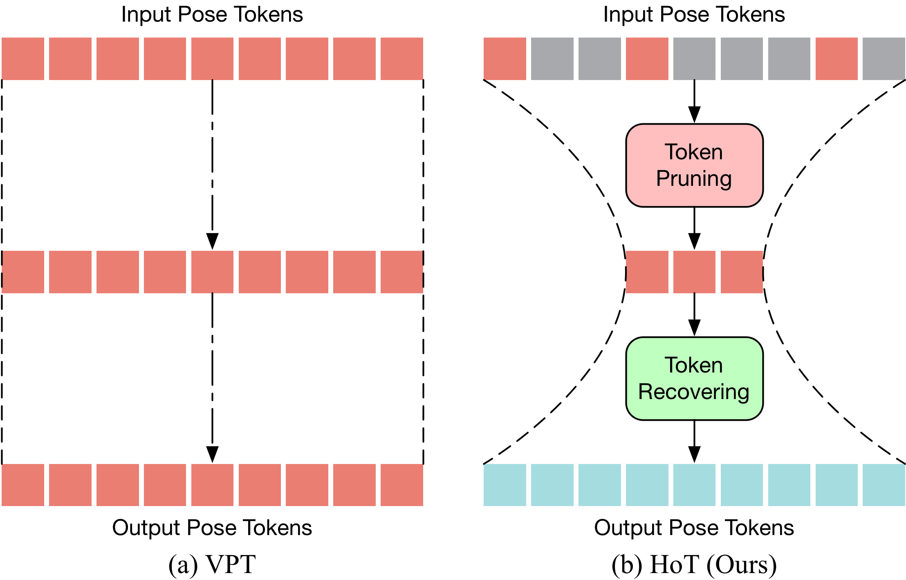

<div align="center"></div>

<h1 align="center"> <a href="https://arxiv.org/pdf/2311.12028">⏳ Hourglass Tokenizer for Efficient Transformer-Based <br> 3D Human Pose Estimation [CVPR 2024 🔥]</a></h1>

<!-- <h1 align="center">⏳ Hourglass Tokenizer for Efficient Transformer-Based <br> 3D Human Pose Estimation [CVPR 2024 🔥]</h1> -->

|   |  |
| ------------- | ------------- |

This is the official implementation of the approach described in the paper of ⏳ Hourglass Tokenizer (🔥HoT🔥):

> [**⏳ Hourglass Tokenizer for Efficient Transformer-Based 3D Human Pose Estimation**](https://arxiv.org/pdf/2311.12028),            
> Wenhao Li, Mengyuan Liu, Hong Liu, Pichao Wang, Jialun Cai, Nicu Sebe             
> *In IEEE Conference on Computer Vision and Pattern Recognition (CVPR), 2024*

## 😮 Highlights

### 🚀 Both high efficiency and estimation accuracy
- 🔥HoT🔥 reveals that maintaining the full-length pose sequence is redundant, and a few pose tokens of representative frames can achieve both high efficiency and performance. 
Our HoT achieves highly competitive or even better results while bringing significant improvements in efficiency compared to the original video pose transformers (VPTs). 
It can reduce nearly 50% FLOPs on MotionBERT without sacrificing performance and nearly 40% FLOPs on MixSTE with only 0.2% performance loss. 

<p align="center"></p>

### ✨ Simple baseline, general-purpose efficient transformer-based framework
- 🔥HoT🔥 is the first plug-and-play framework for efficient transformer-based 3D human pose estimation from videos. 
Unlike existing VPTs, which follow a “rectangle” paradigm that maintains the full-length sequence across all blocks, HoT begins with pruning the pose tokens of redundant frames and ends with recovering the full-length tokens (look like an “hourglass” ⏳). 
It is a general-purpose pruning-and-recovering framework, capable of being easily incorporated into common VPT models on both seq2seq and seq2frame pipelines while effectively accommodating various token pruning and recovery strategies. 

<p align="center"></p>

## 💡 Installation

🔥HoT🔥 is tested on Ubuntu 18 with Pytorch 1.7.1 and Python 3.9. 
- Create a conda environment: ```conda create -n hot python=3.9```
- Install PyTorch 1.7.1 and Torchvision 0.8.2 following the [official instructions](https://pytorch.org/)
- ```pip3 install -r requirements.txt```

## 🐳 Download pretrained models

🔥HoT🔥's pretrained models can be found in [here](https://drive.google.com/drive/folders/1Mr00vyPXMnAX2lA4r1r2L3nR1bR4wvoN?usp=sharing), please download it and put it in the './checkpoint/pretrained' directory. 
  
## 🤖 Dataset setup

Please download the dataset from [Human3.6M](http://vision.imar.ro/human3.6m/) website, and refer to [VideoPose3D](https://github.com/facebookresearch/VideoPose3D) to set up the Human3.6M dataset ('./dataset' directory). 
Or you can download the processed data from [here](https://drive.google.com/drive/folders/112GPdRC9IEcwcJRyrLJeYw9_YV4wLdKC?usp=sharing). 

```bash
${POSE_ROOT}/
|-- dataset
|   |-- data_3d_h36m.npz
|   |-- data_2d_h36m_gt.npz
|   |-- data_2d_h36m_cpn_ft_h36m_dbb.npz
```

## 🚅 Test the model

You can obtain the results of Table 6 of our paper, including the results of MixSTE, HoT w. MixSTE, TPC w. MixSTE, MHFormer, TPC w. MHFormer models. 

```bash
## MixSTE
python main_mixste.py --batch_size 4 --test --frames 243 --stride 243 --model mixste.mixste --previous_dir 'checkpoint/pretrained/mixste' 

## HoT w. MixSTE
python main_mixste.py --batch_size 4 --test --frames 243 --stride 243 --model mixste.hot_mixste --token_num 81 --layer_index 3 --previous_dir 'checkpoint/pretrained/hot_mixste' 

## TPC w. MixSTE
python main_mixste_tpc.py --batch_size 4 --test --frames 243 --stride 1 --model mixste.tpc_mixste --token_num 61 --layer_index 7 --previous_dir 'checkpoint/pretrained/tpc_mixste' 

## MHFormer
python main_mhformer.py --batch_size 256 --test --frames 351 --stride 1 --model mhformer.mhformer --previous_dir 'checkpoint/pretrained/mhformer'

## TPC w. MHFormer
python main_mhformer_tpc.py --batch_size 256 --test --frames 351 --stride 1 --model mhformer.tpc_mhformer --token_num 117 --layer_index 1 --previous_dir 'checkpoint/pretrained/tpc_mhformer' 
```

## ⚡ Train the model

To train MixSTE, HoT w. MixSTE, TPC w. MixSTE, MHFormer, TPC w. MHFormer models on Human3.6M:

```bash
## MixSTE
python main_mixste.py --batch_size 4 --frames 243 --stride 243 --model mixste.mixste

## HoT w. MixSTE
python main_mixste.py --batch_size 4 --frames 243 --stride 243 --model mixste.hot_mixste --token_num 81 --layer_index 3 

## TPC w. MixSTE
python main_mixste_tpc.py --batch_size 4 --frames 243 --stride 243 --model mixste.tpc_mixste --token_num 61 --layer_index 7

## MHFormer
python main_mhformer.py --batch_size 128 --nepoch 20 --lr 1e-3 --lr_decay_epoch 5 --lr_decay 0.95 --frames 351 --stride 1 --model mhformer.mhformer

## TPC w. MHFormer
python main_mhformer_tpc.py --batch_size 210 --nepoch 20 --lr 1e-3 --lr_decay_epoch 5 --lr_decay 0.95 --frames 351 --stride 1 --model mhformer.tpc_mhformer --token_num 117 --layer_index 1
```

## 🤗 Demo
First, you need to download YOLOv3 and HRNet pretrained models [here](https://drive.google.com/drive/folders/1_ENAMOsPM7FXmdYRbkwbFHgzQq_B_NQA?usp=sharing) and put it in the './demo/lib/checkpoint' directory. 
Then, you need to put your in-the-wild videos in the './demo/video' directory. 

Run the command below:
```bash
python demo/vis.py --video sample_video.mp4
```

Sample demo output:

<p align="center"></p>

## ✏️ Citation

If you find our work useful in your research, please consider citing:

    @inproceedings{li2024hourglass,
      title={Hourglass Tokenizer for Efficient Transformer-Based 3D Human Pose Estimation},
      author={Li, Wenhao and Liu, Mengyuan and Liu, Hong and Wang, Pichao and Cai, Jialun and Sebe, Nicu},
      booktitle={Proceedings of the IEEE/CVF Conference on Computer Vision and Pattern Recognition (CVPR)},
      pages={604--613},
      year={2024}
    }

## 👍 Acknowledgement

Our code is extended from the following repositories. We thank the authors for releasing the codes. 

- [MixSTE](https://github.com/JinluZhang1126/MixSTE)
- [MHFormer](https://github.com/Vegetebird/MHFormer)
- [StridedTransformer-Pose3D](https://github.com/Vegetebird/StridedTransformer-Pose3D)

## 🔒 Licence

This project is licensed under the terms of the MIT license.

## 🤝 Contributors

<a href="https://github.com/NationalGAILab/HoT/graphs/contributors">
  
</a>